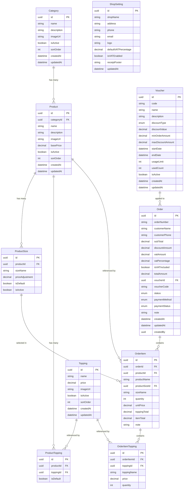

# Entity Relationship Diagram (ERD)

## Store Order Management System - Database Schema



## Relationships Description

### 1. Category → Product (One-to-Many)
- Mỗi Category có thể có nhiều Products
- Mỗi Product thuộc về một Category

### 2. Product → ProductSize (One-to-Many)
- Mỗi Product có thể có nhiều Sizes (S, M, L, XL)
- Mỗi ProductSize thuộc về một Product

### 3. Product ↔ Topping (Many-to-Many via ProductTopping)
- Mỗi Product có thể có nhiều Toppings
- Mỗi Topping có thể được áp dụng cho nhiều Products
- ProductTopping là bảng trung gian mapping

### 4. Voucher → Order (One-to-Many)
- Mỗi Voucher có thể được sử dụng cho nhiều Orders
- Mỗi Order có thể áp dụng một Voucher (hoặc không)

### 5. Order → OrderItem (One-to-Many)
- Mỗi Order chứa nhiều OrderItems
- Mỗi OrderItem thuộc về một Order

### 6. OrderItem → OrderItemTopping (One-to-Many)
- Mỗi OrderItem có thể có nhiều Toppings
- Mỗi OrderItemTopping thuộc về một OrderItem

### 7. Product → OrderItem (One-to-Many - Reference)
- OrderItem tham chiếu đến Product (nhưng lưu snapshot tên và giá)
- Đảm bảo dữ liệu lịch sử không bị ảnh hưởng khi Product thay đổi

### 8. ProductSize → OrderItem (One-to-Many - Reference)
- OrderItem tham chiếu đến ProductSize đã chọn
- Lưu lại thông tin size tại thời điểm đặt hàng

### 9. Topping → OrderItemTopping (One-to-Many - Reference)
- OrderItemTopping tham chiếu đến Topping
- Lưu lại thông tin topping tại thời điểm đặt hàng

### 10. ShopSetting (Standalone)
- Bảng cấu hình độc lập, chỉ có một record duy nhất
- Không có quan hệ trực tiếp với các bảng khác

## Enums Definition

### DiscountType
```csharp
public enum DiscountType
{
    Percentage,     // Giảm theo phần trăm
    FixedAmount     // Giảm số tiền cố định
}
```

### OrderStatus
```csharp
public enum OrderStatus
{
    Pending,        // Chờ xác nhận
    Confirmed,      // Đã xác nhận
    Preparing,      // Đang chuẩn bị
    Ready,          // Sẵn sàng giao/lấy
    Completed,      // Hoàn thành
    Cancelled       // Đã hủy
}
```

### PaymentMethod
```csharp
public enum PaymentMethod
{
    Cash,           // Tiền mặt
    BankTransfer,   // Chuyển khoản
    Card            // Thẻ
}
```

### PaymentStatus
```csharp
public enum PaymentStatus
{
    Pending,        // Chờ thanh toán
    Paid,           // Đã thanh toán
    Refunded        // Đã hoàn tiền
}
```

## Indexes Recommendation

### Primary Indexes (Already defined as PK)
- All `Id` fields are Primary Keys with clustered index

### Secondary Indexes (For Query Performance)

```sql
-- Category
CREATE INDEX IX_Category_IsActive_SortOrder ON Category(IsActive, SortOrder);

-- Product
CREATE INDEX IX_Product_CategoryId ON Product(CategoryId);
CREATE INDEX IX_Product_IsActive ON Product(IsActive);
CREATE INDEX IX_Product_CategoryId_IsActive ON Product(CategoryId, IsActive);

-- ProductSize
CREATE INDEX IX_ProductSize_ProductId ON ProductSize(ProductId);
CREATE INDEX IX_ProductSize_ProductId_IsDefault ON ProductSize(ProductId, IsDefault);

-- Topping
CREATE INDEX IX_Topping_IsActive_SortOrder ON Topping(IsActive, SortOrder);

-- ProductTopping
CREATE INDEX IX_ProductTopping_ProductId ON ProductTopping(ProductId);
CREATE INDEX IX_ProductTopping_ToppingId ON ProductTopping(ToppingId);

-- Voucher
CREATE UNIQUE INDEX IX_Voucher_Code ON Voucher(Code);
CREATE INDEX IX_Voucher_IsActive_StartDate_EndDate ON Voucher(IsActive, StartDate, EndDate);

-- Order
CREATE UNIQUE INDEX IX_Order_OrderNumber ON Order(OrderNumber);
CREATE INDEX IX_Order_Status_CreatedAt ON Order(Status, CreatedAt);
CREATE INDEX IX_Order_CreatedAt ON Order(CreatedAt);
CREATE INDEX IX_Order_VoucherId ON Order(VoucherId);

-- OrderItem
CREATE INDEX IX_OrderItem_OrderId ON OrderItem(OrderId);
CREATE INDEX IX_OrderItem_ProductId ON OrderItem(ProductId);

-- OrderItemTopping
CREATE INDEX IX_OrderItemTopping_OrderItemId ON OrderItemTopping(OrderItemId);
CREATE INDEX IX_OrderItemTopping_ToppingId ON OrderItemTopping(ToppingId);
```

## Data Integrity Rules

### Cascade Delete Rules

1. **Category → Product**: SET NULL or RESTRICT
   - Khi xóa Category, nên RESTRICT (không cho xóa nếu có Product)

2. **Product → ProductSize**: CASCADE
   - Khi xóa Product, tự động xóa các ProductSize

3. **Product → ProductTopping**: CASCADE
   - Khi xóa Product, tự động xóa mapping ProductTopping

4. **Topping → ProductTopping**: CASCADE
   - Khi xóa Topping, tự động xóa mapping ProductTopping

5. **Order → OrderItem**: CASCADE
   - Khi xóa Order, tự động xóa các OrderItem

6. **OrderItem → OrderItemTopping**: CASCADE
   - Khi xóa OrderItem, tự động xóa các OrderItemTopping

7. **Voucher → Order**: SET NULL
   - Khi xóa Voucher, đặt VoucherId trong Order thành NULL

### Soft Delete Implementation

Các entities nên implement Soft Delete:
- Category
- Product
- Topping
- Voucher

Entities không nên soft delete (hard delete):
- Order và các bảng liên quan (giữ lại để audit)
- ProductSize, ProductTopping (xóa thật khi không cần)
- ShopSetting (không xóa)

## Data Validation Rules

### Category
- Name: Required, Max 200 characters
- Description: Max 500 characters
- ImageUrl: Max 500 characters, Valid URL format

### Product
- Name: Required, Max 200 characters
- BasePrice: Required, Must be >= 0
- CategoryId: Required, Must exist in Categories

### ProductSize
- SizeName: Required, Max 50 characters
- PriceAdjustment: Can be negative (discount) or positive (surcharge)
- IsDefault: Only one size can be default per product

### Topping
- Name: Required, Max 200 characters
- Price: Required, Must be >= 0

### Voucher
- Code: Required, Unique, Max 50 characters, Uppercase
- DiscountValue: Required, Must be > 0
- StartDate: Required, Must be < EndDate
- EndDate: Required, Must be > StartDate
- UsageLimit: If set, must be > 0

### Order
- OrderNumber: Auto-generated, Unique, Format: ORD-YYYYMMDD-XXX
- SubTotal: Required, Must be >= 0
- TotalAmount: Required, Must be >= 0
- VATPercentage: Default 10%, Must be >= 0 and <= 100

### OrderItem
- Quantity: Required, Must be > 0
- UnitPrice: Required, Must be >= 0

---

**Status**: ✅ TODO-1.1.1 và TODO-1.1.2 Completed

**Next Steps**: Implement Domain Entities (Phase 1.2)
